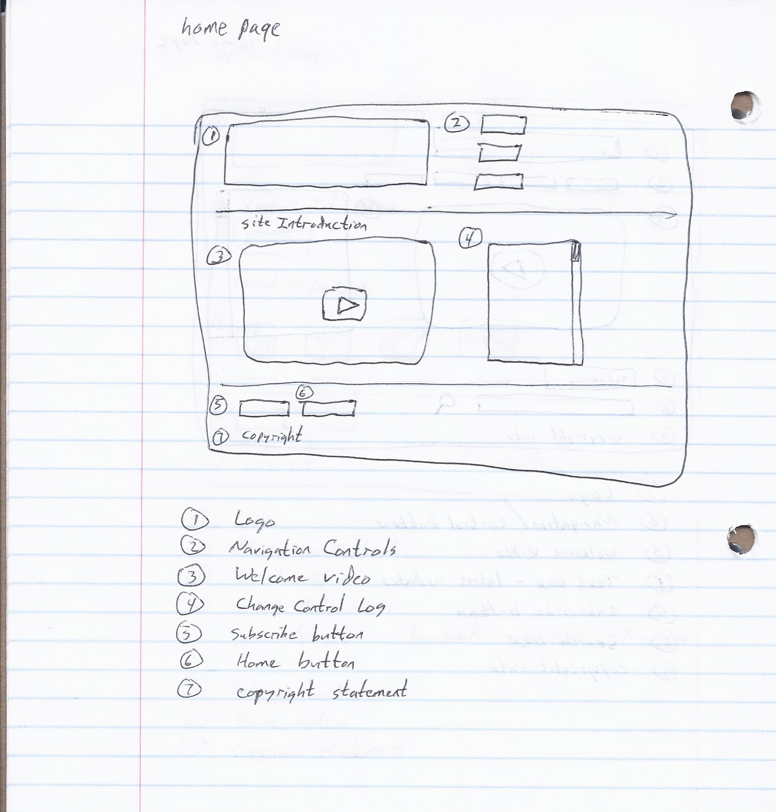
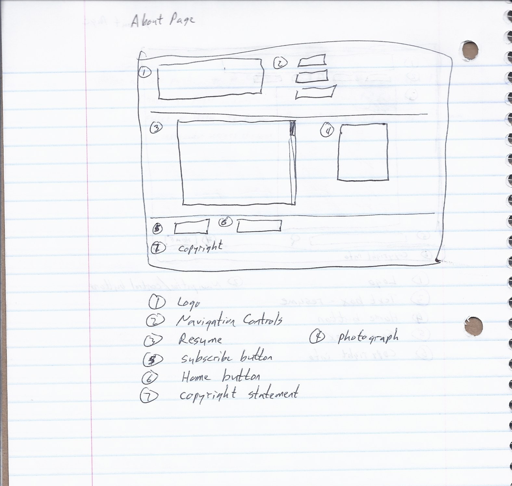
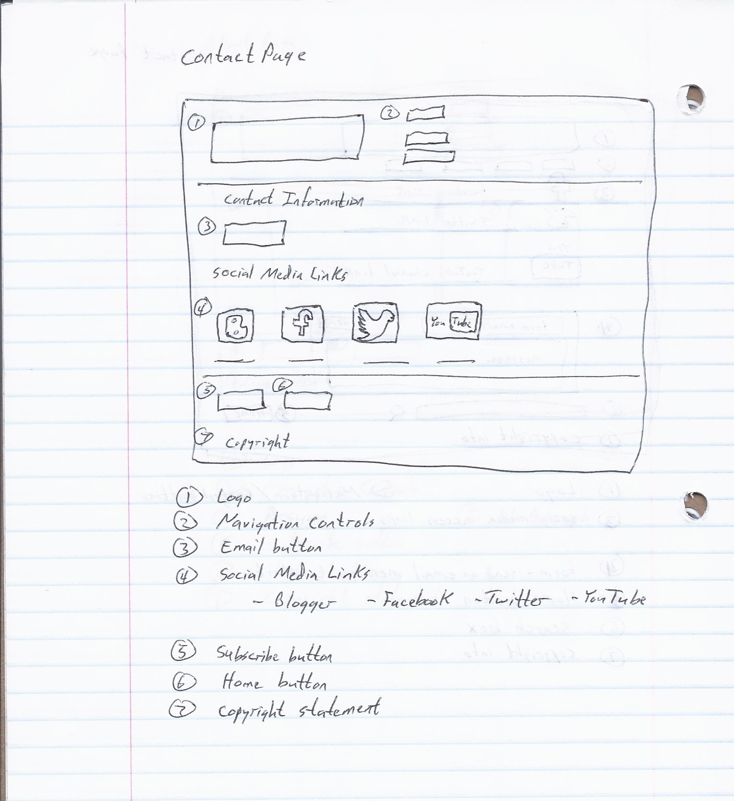

# Maenza INF7420 Project
Martin Maenza - INF7420 - Project

The purpose of my site is to act as a portal or portfolio of my work. The content could include things like a blog, presentations and videos.

This shows the initial wireframes for my proposed website project.

The first wireframe is for my Home page.

Header - includes logo and navigation.

Navigation menu - links to other pages

Content - includes welcome video and scrolling text box of most recent updates

Footer - includes search bar, subscribe button and copyright information

The second wireframe is for my About page.

Header - includes logo and navigation.

Navigation menu - links to other pages

Content - includes a text box with my resume

Footer - includes search bar, home button and copyright information

The third wireframe is for my Contact page.

Header - includes logo and navigation.

Navigation menu - links to other pages

Content - includes links to my social media accounts and a form for sending an email message

Footer - includes search bar, home button and copyright information
